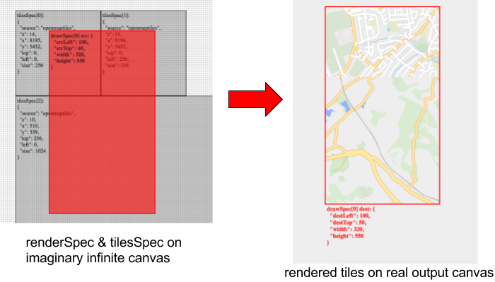
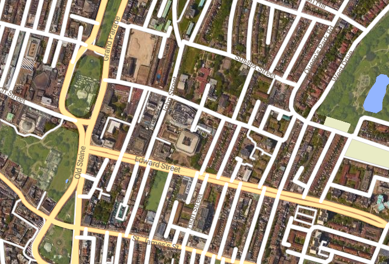

# Mapbox Vector Tile Basic JS Renderer

**This LandInsight project is a fork of [`mapbox-gl-js`](https://github.com/mapbox/mapbox-gl-js).**

[](https://www.mapbox.com/) , [](https://www.landinsight.io/)

Please see the [upstream project](https://github.com/mapbox/mapbox-gl-js) for extensive details on vector tiles, styles and more.  This fork is intended to be kept
fairly up-to-date with the upstream version, and ideally (though this is not currently true) it shouldn't break any functionality of the upstream version.

## Introduction

**A live demo of basic tile rendering is available [here](https://landtechnologies.github.io/Mapbox-vector-tiles-basic-js-renderer/debug/basic/), and a demo of vector tiles on a google map is [here](https://landtechnologies.github.io/Mapbox-vector-tiles-basic-js-renderer/debug/basic/google)**

Screenshots from the basic tile rendering demo...


And a screenshot from the vector tiles on a google map demo...


Unlike other implementations of vector tiles, this renderer is not designed for rendering a fully
featured working map, instead its purpose is to give you fine grain control over rendering individual source tiles.  The idea is that you define the position of one or more source tiles on an imaginary infinite canvas, and then select a part of that imaginary canvas to actually render onto a real canvas.  

With this arrangement, you can do several things with a set of vector tiles, in particular you can create a vector-tile [overlay for google maps]("https://developers.google.com/maps/documentation/javascript/maptypes) - see live demo linked above, and code in `debug/basic/mapbox_google_overlay.js`.

If you find this project useful please, let us know what you are using it for (we are curious)!

The basic usage is as follows:

```javascript
import MapboxBasicRenderer from 'mapbox-gl/src/basic/renderer';

var renderer = new MapboxBasicRenderer({
	style: { 
	  "version": 8,
	  "name": "OSM Liberty",
	  "sources": {
	    "openmaptiles": {
	      "type": "vector",
	      "tiles":["https://somewhere.com/data/v3/{z}/{x}/{y}.pbf"],
	      "name":"OpenMapTiles",
	      minzoom: 12,
	      maxzoom: 16
	    }
	  },
	  "sprite": "https://somewhere.com/sprites/osm-liberty",
	  "glyphs": "https://somewhere.com/font-glyphs/glyphs/{fontstack}/{range}.pbf",
	  "layers": [
	    {
	      "id": "park",
	      "type": "fill",
	      "source": "openmaptiles",
	      "source-layer": "park",
	      "filter": [
	        "all"
	      ],
	      "paint": {
	        "fill-color": "#d8e8c8",
	        "fill-opacity": 0.7,
	        "fill-outline-color": "rgba(95, 208, 100, 1)"
	      }
	    }, ...]
	} 
})


var canvas = document.getElementById('theCanvas');

var renderRef = renderer.renderTiles(
	canvas.getContext('2d'),
	{ 
	    destLeft: 100,
	    destTop: 50,
	    srcLeft: 100,
	    srcTop: 60,
	    width: 320,
	    height: 550
	},[ 
	    {source: "openmaptiles", z: 14, x: 8195, y: 5452, top: 0, left: 0, size: 256},
	    {source: "openmaptiles", z: 14, x: 8196, y: 5452, top: 0, left: 256, size: 256},
	], err => {
		console.log("rendered", err);
	});
```


## Full usage documentation 

### `renderTiles(context, drawSpec, tilesSpec, callback)`
This is the main method, and is shown in the example above.  Everything else bascially exists to
serve the needs of this function.  It might help to look at the [live demo](https://landtechnologies.github.io/Mapbox-vector-tiles-basic-js-renderer/debug/basic/) in conjunction with reading this.

It requires the following inputs:

* `context` - the destination canvas context, you need to call `.getContext(2d)` on an HTML5 canvas to get this.
* `drawSpec`: `{destLeft, destTop, srcLeft, srcTop, width, height}` - defines the src region of the imaginary canvas and the destination region on the real output canvas. Currently no rescalling is supported (you should be able to scale by adjusting the `tilesSpec`).
* `tilesSpec`: `[{source, z, x, y, top, left, size}, ...]` - defines the position of source tiles on the imaginary canvas. Specify
the source tile using its source name together with its `(z,x,y)` values, and use `top,left,size` to state where it goes on the imaginary canvas. You can specify as many tiles as you want, from multiple sources and zooms. Note that the order doesn't matter.
* `callback` - this will be called with an error value, or null, when the render compelets.

The function returns a `renderRef` token which should be passed to `releaseRender` at some point....

### `releaseRender(renderRef)`

For every call to `renderTiles`, you should call `releaseRender` at some later point. You can call it to cancel a render that 
hasn't yet finished, or you could simply call it when the `callback` fires to say the render is compelete.  However, in most (?)
usecases, something that has just been rendered is going to still be on screen and needs to be able to deal with mouse events (see below), or perhaps it may need to be re-rendered very soon using different paint/filter/size settings.  If there is a natural way of defining when a particular render is still "in use" then wait until it goes out of use before calling `releaseRender`.

Note that even after calling `releaseRender`, tiles will still be cached (in two ways actually), so don't feel you need to implement
your own caching system using this feature if there is no clear way of defining an "in use" render.

### `queryRenderedFeatures({source, renderedZoom, lat, lng})`

As mentioned above, any tiles that have been rendered but not yet released with `releaseRender` are available for querying with 
this function.  The `renderedZoom` value is needed for filtering layers (and maybe other things...see `filterForZoom`, below).

This returns an object where the keys are source layers within the named source tileset, and the values are arrays of features.

### `filterForZoom(z)`

Although this renderer doesn't exactly have a concept of rendered-zoom level (it uses `size` in the `tilesSpec` instead), you may have zoom-dependant styles, in which case you need to call this to set the zoom you want to be rendering for. Currently this applies
to all tiles in all renders until you next call it. 

Note that support for zoom-dependant stuff may actually be rather bad. In particular, you need to use an underscore suffix on zooms for a style layer, i.e. `{..., minzoom_:15, maxzoom_: 20}` as they are implemented differently to the upstream mapbox-gl-js.

### `setPaintProperty(layer, prop, val, exec=true)`
See also `setFilter`, `setLayerVisibility`, and `setLayers`, which work in a very similar way.

In this case, you can specify the name of the layer and a paint prop (e.g. `'fill-color'`), and the value you want to apply. 

Exactly how this change takes effect depends on the value of the `exec` flag:

* when `exec=true`, `setPaintProperty` returns a promise that resolves once the requested change has taken effect. If the resolved value turns out to be true, it
means that this config change was the most recently requested change; if the resolved value turns out to be false it
means that one or more additional config changes were requested after this one, and that the other one(s) have also taken effect.

* when `exec=false`, instead of returning a promise, `setPaintProperty` returns a function, and it is only by calling that
function that you then get the promise of the kind described above.  This is useful for when you want to debounce a number of config changes and separate the enquing of changes from the actual execution of the changes. 

### `setFilter(layer, filter, exec=true)`
Works in the same way as `setPaintProperty`, above. In this case you specify the filters to apply to the given layer.

### `setLayerVisibility(layer, isVisible, exec=true)`
Works in the same way as `setPaintProperty`, above. In this case you specify whether the given layer is visible `true`/`false`.

### `setLayers(visibleLayers, exec=true)`
This is very similar to `setLayerVisibility`, execpt that it takes an array of layers that you do want to show, and toggles those on and the rest off.

### `getLayersVisible(zoom, source)`
Returns an array of the style layer names. Both params are optional, if provided the style layers will be filtered based on the zoom (see `filterForZoom` above) and on the `source` name.

### `getLayerOriginalFilter(layer)`
Returns the filter supplied for the given layer at the point of constructing the `MapboxBasicRenderer` instance.

### `getLayerOriginalPaint(layer)`
Similar to `getLayerOriginalFilter`, this returns the paint options supplied for the given layer at the point of constructing the `MapboxBasicRenderer` instance.

### Events 
Use as:

```js
function listner(){ /* something */ };

renderer.on('eventName', listner));
// ...
renderer.off('eventName', listner);

```

* `configChanged` - this event fires every time the config changes (e.g. `setPaintProperty`) have been applied. Specifically, it fires when one of those config promises is about to resolve to `true`.
* `data` - this is basically the same as in mapbox-gl-js. In particular, this fires with `{dataType: "style"}` at the start, when the style has loaded.

## Developing

The main change relative to the upstream repository, is the creation of the `src/basic` directory, and the files within. The `render.js` file there is the main new file, with everything else playing a supporting role.  There is also a `debug/basic` directory for the demo code.

In addition to those directories some other changes have also been made. Some of these changes were critical to the main renderer function, but others are there only because we needed them for LandInsight.

* The package is built with webpack not with browserify.
* The halo around text is rendered in the same pass as the text itself.
* You can use `FORMAT_NUMBER(...)` in text fields..see code in `src/util/token.js`.
* We don't care about Flow or tests here.
* We don't bother with fancy anti-collision placement of symbols

If you have any questions, please [get in touch](https://www.landinsight.io). we would be very keen to collaberate on mataining and developing this project further.

### Some notes

* The `tilesSpec` passed to `renderTiles` is "canonicalized" for the sake of optimization: the coordinate system is re-defined
such that the minimum values are treated as the origin, this means that any `renderTiles` calls that have identical canoncial tilesets can be grouped together.

* Getting tiles from scratch is expensive, so there are several kinds of caching:  Every call to `renderTiles` adds a usage count to the requested tile objects (these objects are created if they don't yet exist), and the call to `releaseRender` decrements this count. Any tile with non-zero usage count is kept in the source cache's `_tilesInUse` map, but once it's usage drops to zero it is moved into a least-recently-used cache, `_tileCache`.  Once it's kicked out of there, then the browser may still have the raw file 
in its cache (if the tile server set cache headers appropriately).  Only - and all - tiles in the `_tilesInUse` are considered when calling `queryRenderedFeatures`.

* You may find it useful to call the `showCanvasForDebug`/`destroyDebugCanvas` functions when developing.

* You may also find it useful to set the `showTileBoundaries` flag to true in the main `painter.render` call.

## License

Mapbox GL JS is licensed under the [3-Clause BSD license](https://github.com/mapbox/mapbox-gl-js/blob/master/LICENSE.txt).
Dependencies may have their own licences.
